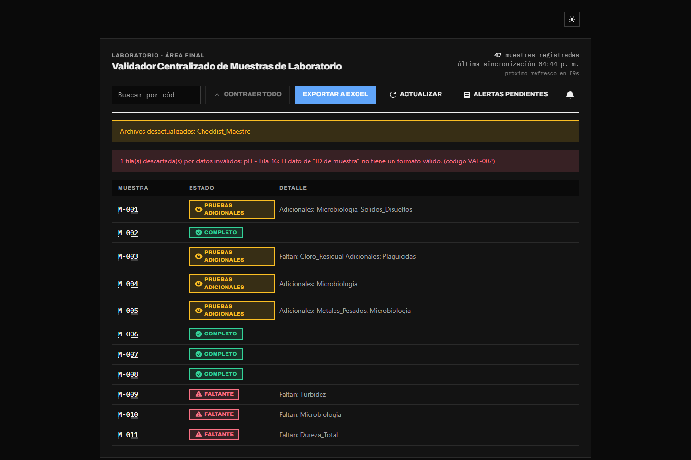
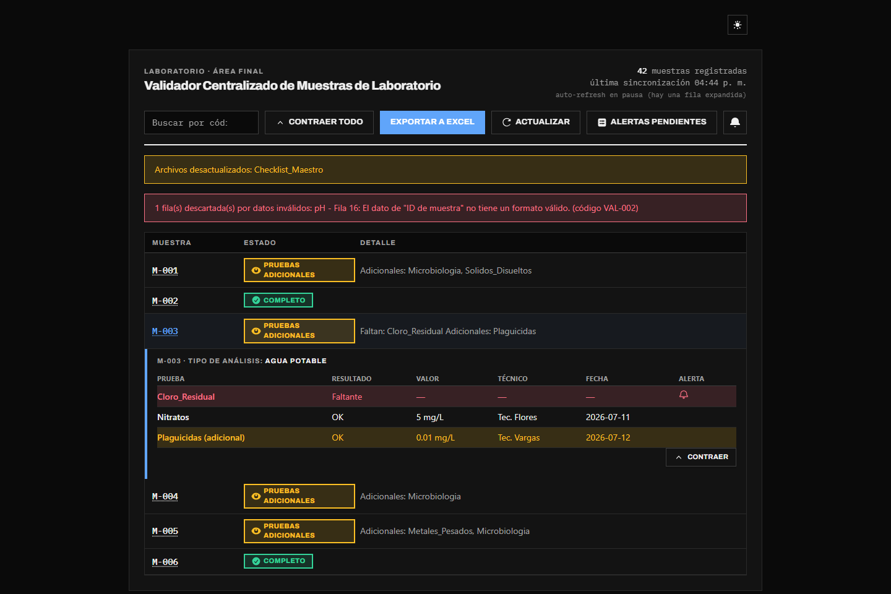

# Validador Centralizado de Muestras de Laboratorio


## El Problema Inicial

En el área final del laboratorio, los técnicos dedicaban tiempo crítico a verificar de manera
manual que cada muestra contara con todas las pruebas requeridas antes de poder emitir los
informes finales. El proceso dependía de cruzar un archivo maestro de requisitos
(`Checklist_Maestro.xlsx`) contra múltiples pestañas de resultados consolidadas en
`Datos.xlsx`. Esta validación manual era frágil y sufría constantemente por errores
tipográficos en los identificadores de muestras, variaciones en los formatos y desfases de
sincronización. El objetivo era construir una automatización de solo lectura que cruzara estos
datos sin alterar los procesos operativos originales.

## La Arquitectura Elegida

Se diseñó un MVP con una arquitectura desacoplada enfocada en escalabilidad y separación de
responsabilidades:

- **Backend (Python/FastAPI):** seleccionado por su velocidad asíncrona y la facilidad para
  integrar validaciones de datos estrictas mediante esquemas Pydantic.
- **Procesamiento (Pandas + RapidFuzz):** se utilizó Pandas para estandarizar la ingesta de las
  múltiples hojas de cálculo. Para tolerar y corregir los errores humanos en la digitación de
  los IDs de muestra, se integró un motor de validación difusa (**TheFuzz** respaldado por
  **RapidFuzz** en C++), garantizando un alto rendimiento computacional vectorial.
- **Frontend (React/TypeScript/Vite):** desacoplado para iterar rápidamente en la interfaz
  (alertas locales persistentes, vistas de detalle expandible) sin necesidad de redesplegar el
  motor de datos.

## Retos Técnicos Superados

**Gestión Resiliente de Memoria** — Para evitar el colapso de RAM ante la ingesta de archivos
pesados, se implementó un sistema de lectura en streaming por lotes utilizando `openpyxl` en
modo `read_only`. Además, el servidor ASGI se configuró limitándolo intencionalmente a 1 worker
de Gunicorn para asegurar que el proceso se ejecute de forma segura dentro del límite de 512MB
de memoria orquestado en Docker.

**Hardening y Seguridad** — La arquitectura fue fortificada contra ataques tipo *Zip Bomb*
mediante la inspección y cálculo de ratios de compresión preventivos antes de desempaquetar
archivos. Se mitigaron vulnerabilidades **XXE** integrando `defusedxml` y se sanitizaron todos
los inputs del motor de búsqueda difusa truncándolos de forma segura a 200 caracteres.

**Tolerancia a Fallos (Partial-Success)** — En lugar de abortar la carga completa por una sola
fila corrupta, se diseñó un flujo de validación que descarta y notifica anomalías a nivel
individual. Esto permite procesar el resto del archivo exitosamente y reflejar los errores
mediante un sistema de códigos legibles en la interfaz, sin interrumpir la operación del
laboratorio.

## Resultados

El sistema ingiere, normaliza y cruza miles de registros identificando muestras completas,
faltantes y pruebas fantasmas adicionales con extrema precisión. La estabilidad del backend
está probada con una suite automatizada contra inyecciones de zips corruptos y payloads HTTP
excesivos.





Cada muestra es expandible en el dashboard para ver el detalle prueba por prueba (resultado,
técnico, fecha) comparado contra lo exigido por el Checklist. El usuario puede añadir una
muestra incompleta a una **Lista de Vigilancia** (persistida en el navegador); cuando una
prueba faltante de una muestra vigilada se completa en una actualización posterior, aparece una
notificación en el buzón local y queda un registro de auditoría en
`data_mock/historial_notificaciones.csv`.

## Estructura

```
data_mock/    Excel de ejemplo + script generador
backend/      API FastAPI (TDD: pytest en backend/tests)
frontend/     Dashboard React (TDD: vitest en frontend/tests)
docs/         ADRs
```

## Cómo correrlo

### Backend

```bash
cd backend
python -m venv venv
./venv/Scripts/pip install -r requirements.txt   # Windows
python data_mock/generar_datos_mock.py            # (re)genera el dataset de ejemplo, desde la raíz del repo
./venv/Scripts/python -m uvicorn app.main:app --reload --port 8000
```

Tests: `./venv/Scripts/python -m pytest`

### Frontend

```bash
cd frontend
npm install
npm run dev   # sirve en :5173, con proxy a la API en :8000
```

Tests: `npm test`

### Con Docker

```bash
cp .env.example .env   # ajustar puertos/DATA_DIR si hace falta
docker compose up --build
```

Backend en `:8000` (Gunicorn + Uvicorn workers, usuario sin privilegios) y frontend en `:5173`
(Nginx sirviendo el build de Vite, también sin privilegios, con proxy interno de `/api` hacia
el backend). Ambos `Dockerfile` son multi-etapa: la imagen final no incluye tests,
`venv`/`node_modules` de desarrollo ni herramientas de build. CI bloqueante en
[`.github/workflows/ci.yml`](.github/workflows/ci.yml) (pytest + vitest + `tsc -b`).

## Notas de compatibilidad

Este entorno corre Python 3.14. `pandas`, `fastapi` y `pydantic` están fijados en
`backend/requirements.txt` a las versiones mínimas que publican wheel precompilado para
`cp314` en Windows — versiones más viejas (p. ej. `pandas==2.2.3`, `pydantic==2.10.4`) intentan
compilar desde código fuente y fallan por falta de toolchain de compilación (MSVC/Rust) en esta
máquina. Se omitió `python-Levenshtein` (acelerador clásico de `thefuzz`, sin wheel para 3.14):
no hizo falta reemplazarlo, porque `thefuzz==0.22.1` ya delega internamente en
[`rapidfuzz`](https://github.com/rapidfuzz/RapidFuzz) (C++, vectorizado), que sí publica wheel
para 3.14 — quedó fijado explícito en `requirements.txt` para dejar esa dependencia real a la
vista.
